# <!-- Dynamic header layout -->

  

<h1 align="center">Pawan Gond</h1>

  
  
  

  <b>Site Reliability Engineer • DevOps Architect • Senior Creative Technologist</b> 
  <i>"I build systems that heal themselves." • Bridging the gap between brilliant code and stunning design.</i>

  Over <b>3+ years of professional experience</b> designing, automating, and operating high-throughput, low-latency production infrastructure alongside highly interactive client interfaces.

---

## 📊 SRE OBSERVABILITY DASHBOARD

  <table width="100%" style="border-collapse: collapse; border: 1px solid #1f242c; background-color: #0d1117;">
    <thead>
      <tr style="background-color: #161b22; border-bottom: 2px solid #1f242c;">
        <th width="33%" align="center" style="padding: 12px; color: #00f5ff; font-family: -apple-system, BlinkMacSystemFont, sans-serif;">🌍 INFRASTRUCTURE SCALE</th>
        <th width="33%" align="center" style="padding: 12px; color: #39ff14; font-family: -apple-system, BlinkMacSystemFont, sans-serif;">⏱️ RELIABILITY METRICS</th>
        <th width="33%" align="center" style="padding: 12px; color: #8a2be2; font-family: -apple-system, BlinkMacSystemFont, sans-serif;">💰 CLOUD FINOPS &amp; OPS</th>
      </tr>
    </thead>
    <tbody>
      <tr>
        <td align="center" style="padding: 15px; border: 1px solid #1f242c; line-height: 1.6;">
          <b>15,000+</b> 
          Production Servers Managed 
          <i>High-Volume, Low-Latency Runtimes</i>
        </td>
        <td align="center" style="padding: 15px; border: 1px solid #1f242c; line-height: 1.6;">
          <b>99.99%</b> 
          Global System Uptime 
          <i>Severity-1 Incident Commander Lead</i>
        </td>
        <td align="center" style="padding: 15px; border: 1px solid #1f242c; line-height: 1.6;">
          <b>70%</b> 
          Cost Optimization Achieved 
          <i>Graviton Migrations &amp; Capacity Design</i>
        </td>
      </tr>
      <tr>
        <td align="center" style="padding: 15px; border: 1px solid #1f242c; line-height: 1.6;">
          <b>-30%</b> 
          Mean Time To Resolve (MTTR) 
          <i>Self-Healing Qdrant RAG Pipeline</i>
        </td>
        <td align="center" style="padding: 15px; border: 1px solid #1f242c; line-height: 1.6;">
          <b>80%</b> 
          Manual Toils Eliminated 
          <i>Automated Database CI/CD Schema</i>
        </td>
        <td align="center" style="padding: 15px; border: 1px solid #1f242c; line-height: 1.6;">
          <b>99%</b> 
          SLA Resolution Rate 
          <i>High-Priority Production Incidents</i>
        </td>
      </tr>
    </tbody>
  </table>

---

## 🛠️ TECHNICAL ARSENAL &amp; SKILLS

To maintain high availability and visual excellence, I leverage a unified, modern toolchain. My configurations are optimized for speed, reliability, and visual coherence.

### 🌐 Cloud &amp; Core Infrastructure Orchestration

  
  
  
  
  
  

### ⚙️ Infrastructure as Code &amp; CI/CD Pipelines

  
  
  
  
  
  
  
  

### 📊 Observability &amp; Telemetry

  
  
  
  
  
  

### 💾 Modern Development &amp; Services

  
  
  
  
  
  
  
  
  
  

---

## 📈 CAREER INCIDENT POST-MORTEMS &amp; UPGRADES

Below are the detailed engineering logs of my contributions and operational impacts over my professional journey. Click the nodes to inspect.

### 🟢 [ACTIVE RUNTIME] SRE — PubMatic (Pune, India)
> **Period:** June 2025 – Present  
> **Primary Role:** Severity-1 Incident Commander &amp; Infrastructure Reliability Architect  
> **Runtime Scale:** 15,000+ Distributed High-Throughput Servers  

<b>🔍 Expand Operational Post-Mortem &amp; Upgrades</b>

 

#### 🛠️ AI-Assisted Incident Responder
*   **Context:** Downtime in high-throughput ad-tech environments directly translates to massive revenue impacts. Manual runbook searches delayed MTTR.
*   **Resolution:** Architected a proactive self-healing incident response helper utilizing a **Retrieval-Augmented Generation (RAG)** pipeline backed by a **Qdrant Vector Database**.
*   **Outcome:** Decreased Mean Time to Resolve (MTTR) by **30%** via automation-driven incident triage workflows and instant AI-driven root-cause alerts.

#### 📢 On-Call Incident Command
*   **Responsibility:** Designated Primary Severity-1 on-call Incident Commander across the global 15k+ server runtime.
*   **Metric Achieved:** Led teams through high-pressure recovery, maintaining **99.99% system availability** for millions of requests per second.

---

### 🟡 [ARCHIVED BUILD] DevOps Engineer — LogiNext (Mumbai, India)
> **Period:** December 2022 – June 2025  
> **Primary Role:** Cloud FinOps Architect &amp; CI/CD Pipeline Automation Engineer  
> **Archived Health:** Decommissioned with 70% overall operational cost efficiency.  

<b>🔍 Expand Optimization Log &amp; Post-Mortem</b>

 

#### ⚡ Recovery Time Objective (RTO) Minimization
*   **Context:** Disaster scenarios in key regions required rapid failovers with minimal data loss thresholds.
*   **Resolution:** Re-engineered and automated multi-region disaster recovery replication pipelines across MongoDB and MySQL database layers.
*   **Outcome:** Slashed database Recovery Time Objective (RTO) by **70%**, guaranteeing minimal data loss boundaries.

#### 🔄 Schema Migration Automation
*   **Context:** Manual database deployments delayed developer release cycles and introduced human errors.
*   **Resolution:** Created automated CI/CD database schema migration pipelines, removing manual interference.
*   **Outcome:** Eliminated **80% of manual tasks** and expedited weekly deployment speeds.

#### 💵 Cloud FinOps &amp; Infrastructure Optimization
*   **Resolution:** Led cross-region instance migration campaigns from legacy architectures to high-performance Graviton processor units; optimized block storages and S3 tier structures.
*   **Outcome:** Realized a **30% direct reduction** in cloud operational costs.
*   **Compliance:** Maintained a **99% SLA resolution rate** on developer issues and high-severity platform tickets.

---

## 🏆 CERTIFICATIONS
*   **Microsoft Certified:** Azure AI Fundamentals
*   **Google Cloud:** Computing Foundations with Kubernetes
*   **Python 3:** Advanced Certified Developer

---

## 📂 FEATURED SYSTEMS &amp; SCHEMATICS

### 🚀 KubeFlow Pipelines (Multi-Cluster Engine)
*   An automated, highly reliable multi-cluster deployment pipeline orchestrating continuous delivery across isolated environments.
*   **Flow Schema:** `Developer Commit` ➡️ `GitHub Actions` ➡️ `Docker Build` ➡️ `ArgoCD Reconciliation` ➡️ `Kubernetes Pod Rollout`
*   **Stack:** `Go` • `Kubernetes` • `ArgoCD` • `Docker`

### 📊 Observability Telemetry Stack
*   A premium, high-performance logging, distributed tracing, and metrics collection stack structured to handle extreme throughput volumes with zero telemetry losses.
*   **Stack:** `Prometheus` • `Grafana` • `OpenTelemetry` • `Elasticsearch` • `Kibana`

### 🤖 Serverless SRE Bot (Slack ChatOps)
*   A lightweight, reactive SRE bot designed to decrease MTTR by automating incident routing, severity flagging, and instant database log aggregation directly inside Slack.
*   **Stack:** `AWS Lambda` • `Node.js` • `Slack API` • `CloudWatch`

---

## 📊 TELEMETRY &amp; GITHUB STATS

  
  &nbsp;&nbsp;
  

---

  Console constructed by <a href="https://github.com/pawangond">pawangond</a>. Dynamic keyframe render active.

